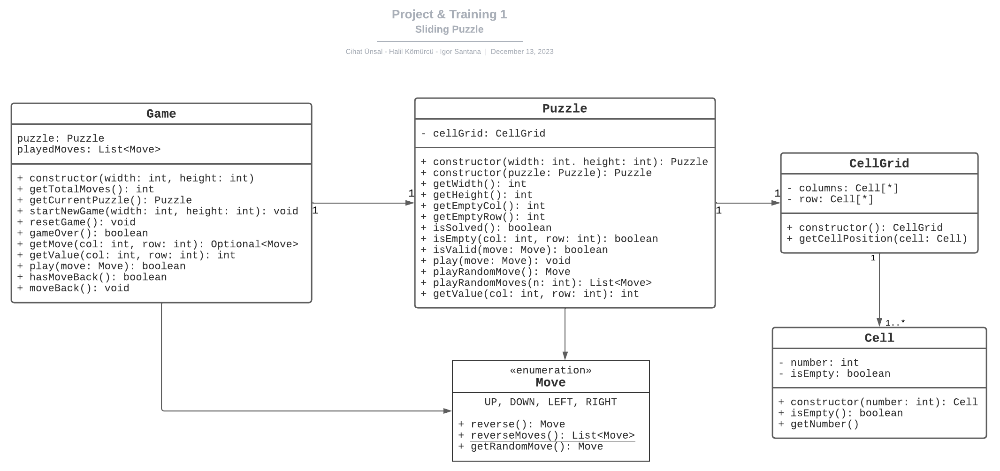

# Project & Training 1
___

### Developers
[![cihat]][cihat-profile]  &nbsp; [![halil]][halil-profile] &nbsp; [![igor]][igor-profile]

### Supervisor
[![haenni]][haenni-profile]
___
## Sliding Puzzle
#### Introduction
In the thrilling Block 3 project, our mission is to craft an exhilarating Java program that puts you in the driver's
seat to conquer the Slidign Puzzle game! Get ready to dive into the challenge and experience the excitement of
playing this captivating game.

#### Game description
A sliding puzzle is a challenging combination puzzle where players slide pieces on a board to
achieve a specific configuration without lifting them. The pieces, often two-dimensional,
can be shapes, colors, or parts of a larger picture. The classic example is the fifteen puzzle,
dating back to 1880, which initiated a puzzle craze. Modern versions may include letters to form words,
and sliding puzzles have transitioned into puzzle video games. The objective is to rearrange the pieces within
the confines of the board without lifting them.

### UML Class Diagram

draft:

*UML class diagram: created with [Lucidchart](https://www.lucidchart.com)*

___
[cihat]:https://img.shields.io/badge/Cihat_Ünsal-grey?style=for-the-badge&logo=gitlab
[cihat-profile]:https://gitlab.ti.bfh.ch/unsac1
[halil]:https://img.shields.io/badge/Halil_Kömürcü-grey?style=for-the-badge&logo=gitlab
[halil-profile]:https://gitlab.ti.bfh.ch/halik1
[igor]:https://img.shields.io/badge/Igor_Santana-grey?style=for-the-badge&logo=gitlab
[igor-profile]:https://gitlab.ti.bfh.ch/santi1
[haenni]:https://img.shields.io/badge/Rolf_Haenni-grey?logo=gitlab
[haenni-profile]:https://gitlab.ti.bfh.ch/hnr1# sliding-puzzle
