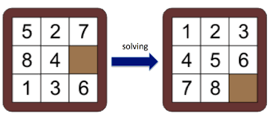
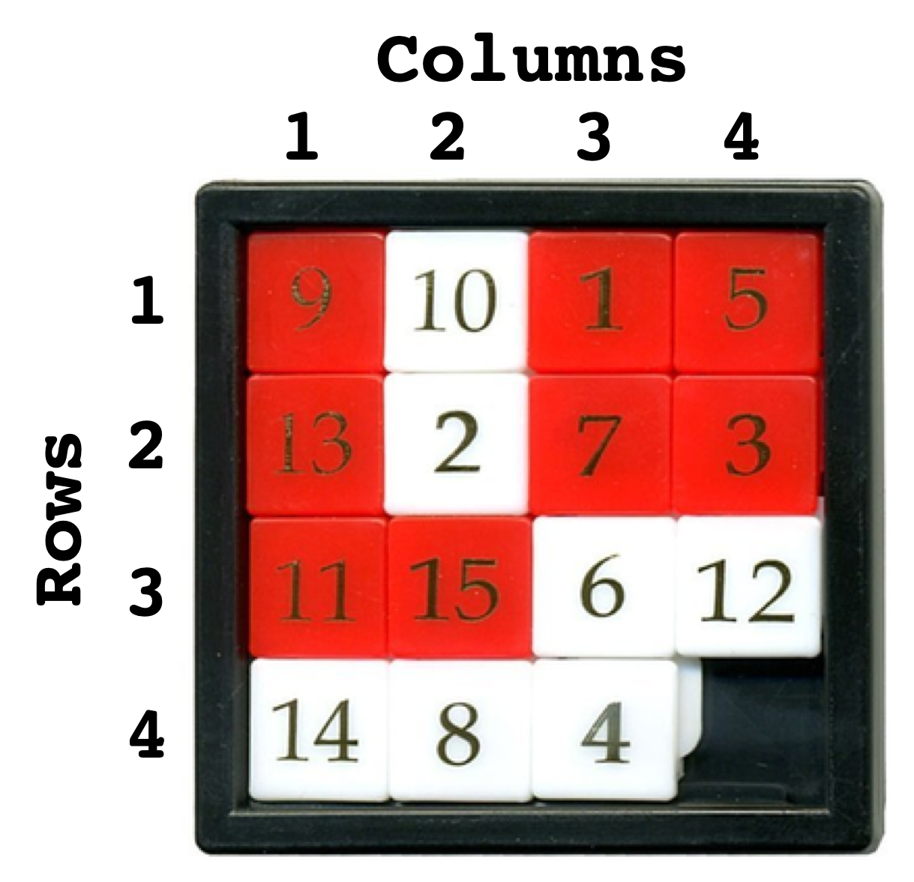
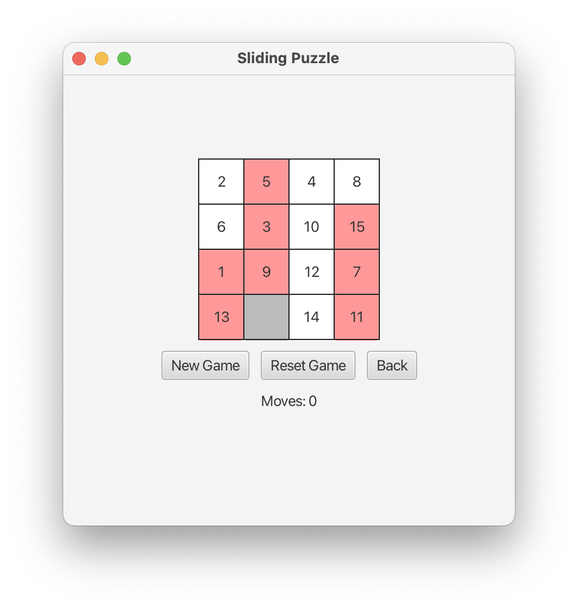
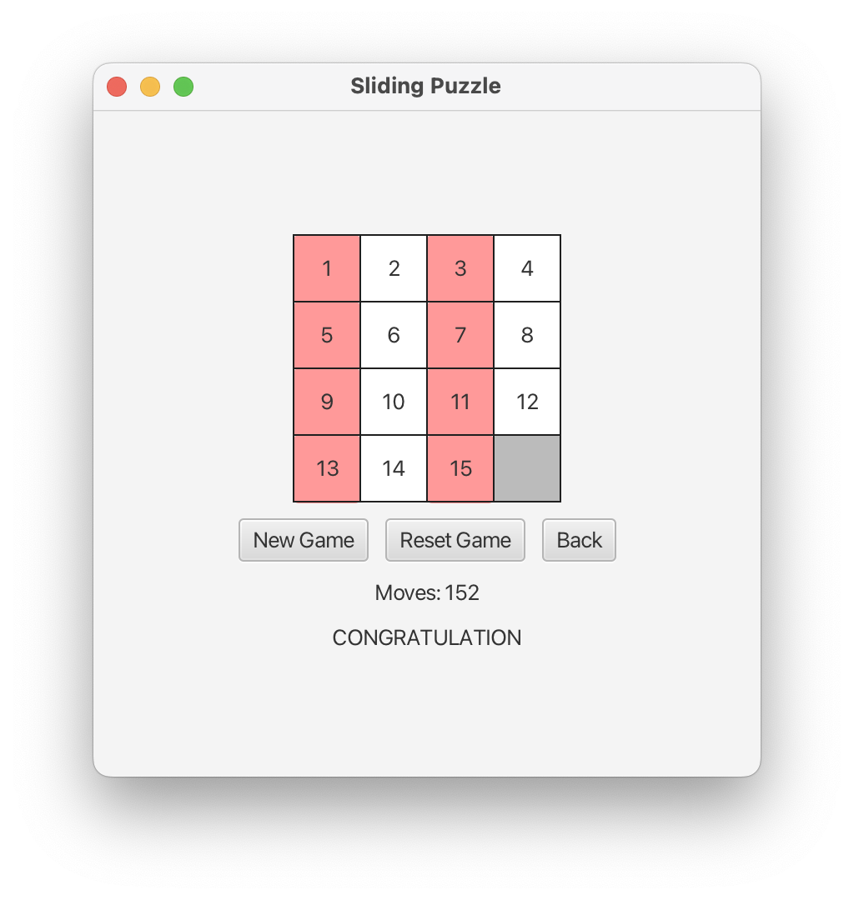

# Project & Training 1 (Block 3)


## Introduction

The goal of this Block 3 project is to develop a Java/Kotlin program to play the *Sliding Puzzle* game. The game can be
played online, for example https://appzaza.com/tile-slide-game.

### Game Rules

The game is played on a board of size *N* (width) times *M* (height). Each of the cells contains a number between 1 and 
*NxM-1*, except for the *empty cell*. Moves are possible relative to the empty cell, by shifting one the neighboring 
cells into the empty cell. Therefore, there are four possible moves, which we call *UP*, *DOWN*, *LEFT*, and *RIGHT*.
Note that if the empty cell is at the top, bottom, left, or right border, then some of the four moves are impossible. We
call them *invalid*, in contrary to the *valid* ones.

At the beginning of the game, the cells are completely unordered. The goal of the game is to solve the puzzle, which 
corresponds to reaching a state in which all cells are numbered from 1 to *NxM-1*, starting row-wise from top left to 
bottom right. In that case, the empty cell is at bottom of the rightmost column. The goal of the game is illustrated in 
the following figure.



The columns of the sliding puzzle are numbered from 1 to *N* and the rows are numbered from 1 to *M*, as illustrated
in the following picture:



### Examples

Your implementation must consist of both a console app and an app with a graphical user interface (JavaFx/TornadoFX). 
Below you see some self-explanatory screenshots of how your solution could look like.

#### Console App (3x3 Game)

```
WELCOME TO THE SLIDING PUZZLE APP
Commands: u=up, d=down, l=left, r=right, b=back, n=new, s=reset, q=quit
+--+--+--+
| 3| 7| 4|
+--+--+--+
| 1|  | 8|
+--+--+--+
| 6| 2| 5|
+--+--+--+
Moves = 0
> u
+--+--+--+
| 3| 7| 4|
+--+--+--+
| 1| 2| 8|
+--+--+--+
| 6|  | 5|
+--+--+--+
Moves = 1
> l
+--+--+--+
| 3| 7| 4|
+--+--+--+
| 1| 2| 8|
+--+--+--+
| 6| 5|  |
+--+--+--+
Moves = 2
> d
+--+--+--+
| 3| 7| 4|
+--+--+--+
| 1| 2|  |
+--+--+--+
| 6| 5| 8|
+--+--+--+
Moves = 3

:
:

> l
+--+--+--+
| 1| 2| 3|
+--+--+--+
| 4| 5|  |
+--+--+--+
| 7| 8| 6|
+--+--+--+
Moves = 37
> u
+--+--+--+
| 1| 2| 3|
+--+--+--+
| 4| 5| 6|
+--+--+--+
| 7| 8|  |
+--+--+--+
Moves = 38
CONGRATULATION
> q
Bye
```

#### JavaFx/TornadoFX App (4x4 Game)




## Tasks

Template classes with empty methods are given for the following classes:

- `Move`
- `Puzzle`
- `Game`

All methods of these classes are already documented. You must implement these methods according to the documentation. 
For each of these classes, you also get a JUnit test class, for example `MoveTest` for `Move`. The goal for your
implementation is to pass all tests from all three test classes.

You also get template classes `ConsoleApp` for the console app and `JavaFXApp` fo the JavaFX application.

- In the console app, moves are entered over the keyboard, for example "u" means moving up, "d" means moving down, etc.
Additional commands for backtracking ("b"), resetting the current game ("s"), starting a new game ("n"), and quitting
the game ("q") must be provided. If the puzzle is solved, a message should appear.
- In the JavaFX app, moves are entered by clicking on the cell to move. Buttons for backtracking, resetting the current 
game, and starting a new game must be provided. If the puzzle is solved, a message should appear.

## Evaluation Criteria

These are the evaluation criteria:

* Correct implementation of the game logic (all provided test pass)
* A running console application
* A running JavaFX/TornadoFX application

To pass this module, all three criteria above must be fulfilled to a satisfactory degree.

We also expect you to submit clean code (no warnings, no unused code, no TODOs), to strictly apply naming conventions,
and to declare variables and methods properly as private/public/protected.

## Importing the Project into Eclipse or IntelliJ

To import the project from the Git repository into Eclipse, select 
<code>File -> Import... -> Git -> Projects from Git (with smart import) -> Clone URI</code>. 
In IntelliJ, select <code>File -> New -> Project from version control -> Git -> clone</code>. In both cases, copy/paste 
the repository URL from the GitLab web page.

The given repository contains a Maven project, which defines the necessary dependencies. By importing the project into 
your IDE, the dependencies should be resolved automatically.

## Maven

To execute the console application <code>ch.bfh.bti3001.slidingpuzzle.ConsoleApp</code> with Maven, type:

> `mvn clean compile exec:java`

To execute the JavaFX/TornadoFX application <code>ch.bfh.bti3001.slidingpuzzle.JavaFxApp</code> with Maven, type:

> `mvn clean compile javafx:run`
